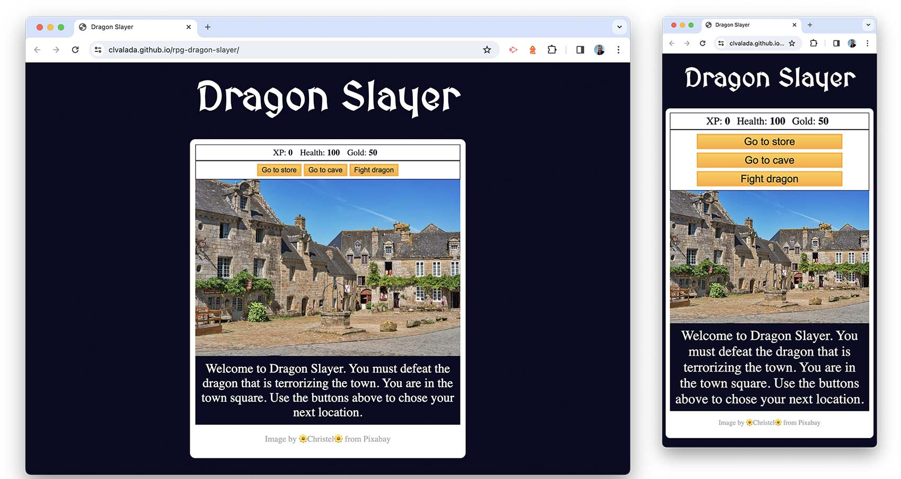

# Dragon Slayer

## Description
Dragon Slayer is a role-playing-game based on a freeCodeCamp.org tutorial. Once I completed the tutorial, I added images from Pixabay and edited the CSS to improve the UX. 

[Learn Basic JavaScript by Building a Role Playing Game](https://www.freecodecamp.org/learn/javascript-algorithms-and-data-structures-v8/)

## Table of Contents

- [Description](#description)
- [Screenshots](#screenshots)
- [Usage](#usage)
- [Contact Me](#contact)
- [Credits](#credits)
- [Licenses](#licenses)

## Screenshots

## Usage
Visit the website below and follow the prompts to play the game.

https://clvalada.github.io/rpg-dragon-slayer/

## Credits

[Learn Basic JavaScript by Building a Role Playing Game](https://www.freecodecamp.org/learn/javascript-algorithms-and-data-structures-v8/)

## License

MIT License